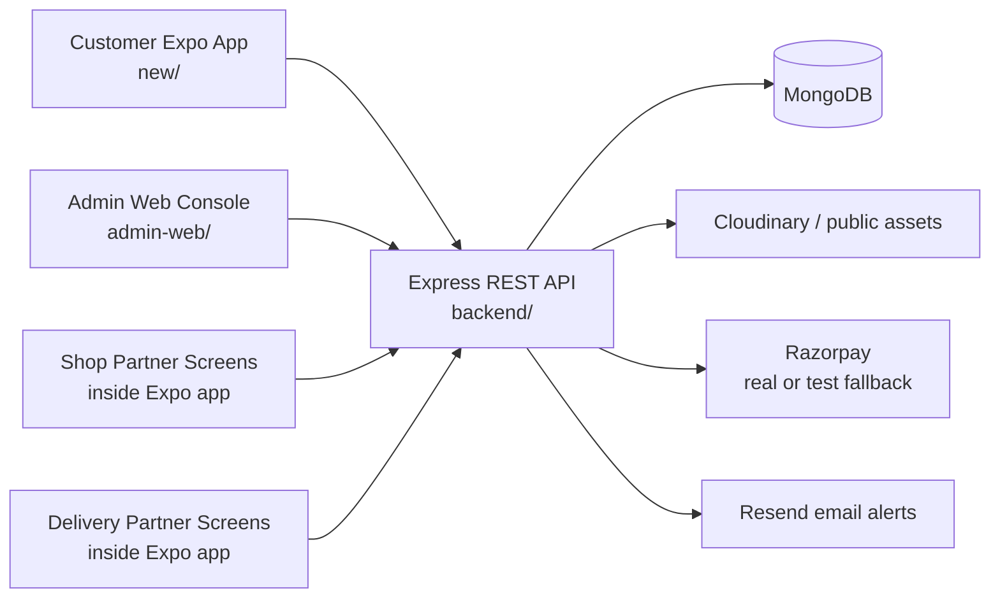
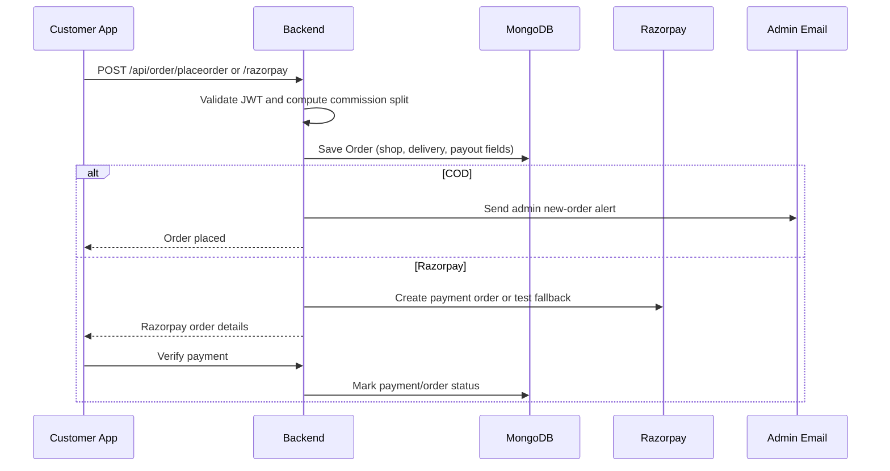

# FreshMart / AkA Marketplace - Project Flow

**Scan date:** 2026-10-03  
**Project type:** React Native Expo customer app + React/Vite admin panel + Express/MongoDB API

Ye file current codebase ka implementation map hai. Iska purpose ye samajhna hai ki ab tak kya bana hua hai, kaunsa flow kaam kar raha hai, aur agla development kis order me karna chahiye.

## 1. High-level Architecture



### Main folders

| Folder | Current role |
|---|---|
| `new/` | Customer-facing Expo Router mobile/web app. Customer shopping, auth, cart, checkout, orders, returns, shops and partner onboarding screens. |
| `admin-web/` | Vite + React admin console. Admin login, dashboard, products, orders/dispatch, banners, partners and returns. |
| `backend/` | Express API, JWT auth, MongoDB models, order/payment logic, partner logic, email notifications and image configuration. |

## 2. Customer App Flow

### App startup and navigation

1. Global layout loads `SafeAreaProvider`, `AuthProvider` and `CartProvider`.
2. `new/app/index.tsx` currently redirects directly to `/(root)/(tabs)`.
3. Main tabs are:
   - Home: product feed, categories, promotional banners and store content.
   - Saved: wishlist/favorites.
   - Search: product search/filter.
   - Profile: account and related actions.
4. Product details, cart, checkout, orders, shops and partner dashboards are stack screens outside the tab bar.
5. Bottom navigation uses a custom floating pill bar with Ionicons.

### Customer authentication

Implemented in `new/context/AuthContext.tsx` and `new/app/(auth)/`:

- Sign up calls `POST /api/auth/registration`.
- Sign in calls `POST /api/auth/login`.
- User token and basic user data persist in `expo-secure-store` on native and `localStorage` on web.
- Logout clears local session and calls backend logout.
- Auth state exposes `user`, `token`, `isLoading`, `isAuthenticated` and `updateUser`.
- Backend validates email, hashes password with bcrypt and issues JWT.
- Google login endpoint exists in backend, but the mobile button currently shows a placeholder alert.
- Forgot-password UI is present as a label/action placeholder; backend flow is not implemented.

### Shopping and product flow

1. Home/search requests products from `GET /api/product/list`.
2. Product details use `GET /api/product/:id` and product review APIs.
3. User can select a size/variant and add product to cart.
4. Cart supports quantity changes and clear-cart behavior.
5. Guest cart is stored locally; authenticated cart is synchronized with backend cart APIs.
6. Product reviews are supported after purchase validation in the backend.
7. Shop listing and shop detail screens use shop APIs and can show shop products/open status.

### Cart and checkout

`new/context/CartContext.tsx` calculates:

- cart item count
- subtotal
- delivery fee
- grand total

Checkout supports:

- saved/current cart items
- delivery address
- order notes and order type
- COD order placement
- Razorpay order creation and verification
- user order history after successful placement

Backend order flow:



### Orders, returns and reviews

- Customer orders: `new/app/(root)/orders.tsx` and `POST /api/order/userorder`.
- Return request: only delivered orders can be returned; duplicate item return is blocked.
- Return data supports reason, description, refund/replace action, UPI or bank details.
- Customer return history: `GET /api/return/my`.
- Product reviews require that the user has purchased the product and cannot review the same product twice.
- Backend sends admin/customer email alerts for return events where mail configuration is available.

## 2A. Complete `new/app` Route Map

This is the detailed screen map for the Expo app inside the `new/` folder.

| Route/file | Current implementation |
|---|---|
| `app/index.tsx` | Startup redirect. Currently opens the main tabs without checking auth first. |
| `app/_layout.tsx` | Global stack, safe areas, `AuthProvider`, `CartProvider` and global CSS. |
| `app/(auth)/sign-in.tsx` | Email/password login, validation, error state, password visibility, remember checkbox and Google placeholder. |
| `app/(auth)/sign-up.tsx` | Customer registration form connected to `AuthContext`. |
| `app/(auth)/register-shop.tsx` | Shop onboarding with KYC choice, address, Rs 500 UPI instructions and registration API call. |
| `app/(auth)/register-delivery.tsx` | Delivery onboarding with KYC, vehicle details, Rs 500 registration data and API call. |
| `app/(root)/(tabs)/index.tsx` | Home: live products, fallback catalog, categories, banners, search shortcut, cart badge and floating cart action. |
| `app/(root)/(tabs)/saved.tsx` | Saved/wishlist products screen. |
| `app/(root)/(tabs)/search.tsx` | Product search and filtering screen. |
| `app/(root)/(tabs)/profile.tsx` | User profile, account actions, order/partner navigation and logout. |
| `app/(root)/product/[id].tsx` | Product detail, image gallery, size choice, add/buy now, shop contact and reviews. |
| `app/(root)/cart.tsx` | Cart item list, quantity controls, totals and checkout navigation. |
| `app/(root)/checkout.tsx` | Address form, saved address, GPS permission/reverse geocoding, COD and Razorpay/test payment UI. |
| `app/(root)/orders.tsx` | User order history, status timeline and delivered-order return/replacement form. |
| `app/(root)/shops.tsx` | Verified shop list, category/search filters, call/WhatsApp inquiry and shop detail navigation. |
| `app/(root)/shop/[id].tsx` | Individual shop details and shop product/material browsing. |
| `app/(root)/shop-dashboard.tsx` | Shop login/session, material listing, open/closed toggle and payout request UI. |
| `app/(root)/delivery-dashboard.tsx` | Delivery partner dashboard for online state, available orders, acceptance, status and location actions. |

### Expo app data dependencies

- `context/AuthContext.tsx`: customer token/session lifecycle.
- `context/CartContext.tsx`: guest local cart plus authenticated backend cart sync.
- `config/api.ts`: all customer, shop and delivery endpoint URLs.
- `components/Footer.tsx`: shared customer app footer content.
- `assets/images/`: local image assets; many screens also use remote image URLs.

### Important Expo flow notes

- Home has fallback demo products and fallback promotional slides, then attempts to replace them with backend data.
- Checkout persists address and payment preference locally for repeat orders.
- GPS checkout stores latitude/longitude and includes them in the order address for admin maps/email.
- Shop dashboard saves its own session separately under `aka_shop_session`.
- Shop payout request currently displays a success alert; there is no visible payout request API call yet.
- Delivery dashboard is wired to delivery APIs, but the route layer still needs delivery JWT enforcement.

## 3. Shop Partner Flow

Screens and API foundation are present:

1. User opens `register-shop.tsx`.
2. Form collects shop name, owner, phone, password, category, address and GST/Aadhaar verification.
3. Registration fee fields are included with a stated one-time fee of Rs 500.
4. Backend creates a shop, hashes the password, creates a shop JWT and currently saves the shop as `Approved` for testing/demo speed.
5. Shop login supports phone, Aadhaar number or GST number.
6. Shop can add products and view its own products.
7. Shop open/closed status can be toggled.
8. Customers can list active shops and open a shop detail page.

Relevant files:

- `new/app/(auth)/register-shop.tsx`
- `new/app/(root)/shop-dashboard.tsx`
- `new/app/(root)/shops.tsx`
- `new/app/(root)/shop/[id].tsx`
- `backend/controller/shopController.js`
- `backend/routes/shopRoutes.js`

### Current partner limitation

Shop JWTs are generated, but shop operations currently receive `shopId` from the request and are not protected by a dedicated shop-auth middleware. Before production, the backend should verify that the logged-in shop owns the requested `shopId`.

## 4. Delivery Partner Flow

1. User opens `register-delivery.tsx`.
2. Form collects personal data, phone/password, Aadhaar or driving license, vehicle type/number and fee transaction details.
3. Backend creates a delivery partner, hashes password, creates a delivery JWT and currently sets status to `Approved` for testing.
4. Partner can login, toggle online/offline status and update live location.
5. Partner can fetch unassigned orders, accept an order and update delivery status.
6. Admin can view and approve/manage delivery partners.
7. Customer/admin order records store assigned rider and delivery payout information.

Relevant files:

- `new/app/(auth)/register-delivery.tsx`
- `new/app/(root)/delivery-dashboard.tsx`
- `backend/controller/deliveryController.js`
- `backend/routes/deliveryRoutes.js`
- `backend/model/deliveryModel.js`

### Current partner limitation

Delivery endpoints for partner actions are currently public at route level. A production-ready implementation needs delivery-auth middleware and ownership checks for `partnerId`, order acceptance and status/location updates.

## 5. Admin Web Flow

### Admin authentication

1. `admin-web/src/App.tsx` wraps the UI with `AdminAuthProvider`.
2. On startup, saved admin token is read from `localStorage`.
3. Token is verified through `GET /api/user/getadmin`.
4. Login calls `POST /api/auth/adminlogin`.
5. Backend compares credentials with `ADMIN_EMAIL` and `ADMIN_PASSWORD`, then issues an admin JWT.
6. Invalid/no token shows the admin login screen.

### Admin dashboard and data refresh

After login, `App.tsx` globally fetches:

- all orders
- all products
- delivery partners
- pending returns count

Orders are refreshed every 20 seconds. A new order count increase triggers a browser audio chime when sound is enabled.

### Admin modules already built

| Module | What is available |
|---|---|
| Dashboard | Revenue, order count, pending/delivered counts, product count, recent orders and quick actions. |
| Orders & Dispatch | Search by customer/phone/city/order ID, status filters, status updates, rider assignment, maps link and invoice modal/download. |
| Store Catalog | Product search, category filters/counts, card/table view, delete product and add-product navigation. |
| Add Product | Product details, category/subcategory, size presets/custom sizes, bestseller flag, up to five images via file or URL, multipart upload. |
| Promotional Banners | Five banner slots, image upload/URL, text/category fields and per-slot save. |
| Partners & Splits | Partner management entry point and backend endpoints for shops/delivery/split summaries. |
| Customer Returns | List all returns and approve/reject requests. |
| Responsive shell | Persistent desktop sidebar, mobile drawer, header, loading states and badges for pending orders/returns. |

## 6. Backend Modules and API Map

`backend/index.js` mounts these API groups:

| API group | Main responsibility |
|---|---|
| `/api/auth` | Customer registration/login/logout, Google login endpoint and admin login. |
| `/api/user` | Current user and admin verification. |
| `/api/product` | Product list/detail/add/remove and product data. |
| `/api/cart` | Authenticated cart get/add/update/clear behavior. |
| `/api/order` | Customer orders, COD, Razorpay, payment verification, admin status, rider assignment, splits and invoice. |
| `/api/return` | Customer return request/history and admin review/update. |
| `/api/review` | Product review add/list and average ratings. |
| `/api/setting` | App settings and promotional banners. |
| `/api/shop` | Shop registration/login/list/detail/products/open status/admin approval. |
| `/api/delivery` | Delivery registration/login/availability/acceptance/status/location/admin approval. |

### Security already present

- JWT authentication for customer routes through `isAuth`.
- Admin JWT validation and email allow-list through `adminAuth`.
- bcrypt password hashing for customer, shop and delivery accounts.
- Bearer token support in addition to cookies.
- CORS configuration for local and production origins.
- Secrets are expected through environment variables.

### Integrations already wired

- MongoDB via Mongoose.
- Cloudinary configuration for media uploads.
- Resend mailer for admin order, user registration and return alerts.
- Razorpay with real-key mode and a test-mode fallback when keys are absent.
- Invoice generation/download endpoint.

## 7. What Is Complete vs Partial

### Mostly implemented

- Customer UI shell and tab navigation.
- Customer registration/login/session persistence.
- Product browsing and product details.
- Guest and authenticated cart behavior.
- Checkout/order creation for COD and Razorpay path.
- User order history and return request path.
- Product review backend validation.
- Admin login and protected admin console.
- Admin dashboard, product CRUD basics, order dispatch controls and returns moderation.
- Banner management.
- Shop and delivery onboarding foundation.
- Commission/payout split fields and calculation in orders.
- Email notification foundation.

### Partial or needs verification

- `new/app/index.tsx` does not yet redirect unauthenticated users to sign-in; it always opens the main tabs.
- Google sign-in is UI-only in the mobile app.
- Forgot password is UI-only.
- Shop and delivery partner sessions are not connected to a shared auth context in the visible app flow.
- Partner API routes need dedicated partner authentication and ownership checks.
- Shop/delivery registrations are auto-approved in controller code, suitable for testing but not final marketplace policy.
- Admin Partners page and split-settlement workflow should be checked for complete controls and actual settlement actions.
- Payment, email, Cloudinary and live location behavior depend on environment keys and device/server configuration.
- Automated tests are not visible in the scanned project structure.

## 8. Recommended Next Build Order

### Priority 1 - Make authentication behavior correct

1. Add an auth gate in `new/app/index.tsx` using `isLoading` and `isAuthenticated`.
2. Redirect logged-out users to sign-in and logged-in users to tabs.
3. Protect authenticated-only screens and handle expired JWTs globally.
4. Decide whether Google login and forgot password are required; then implement them end-to-end or remove/disable their placeholders.

### Priority 2 - Secure partner workflows

1. Add `shopAuth` and `deliveryAuth` middleware.
2. Read shop/delivery identity from verified JWT instead of trusting body `shopId`/`partnerId`.
3. Protect add-product, my-products, toggle, location, accept-order and status routes.
4. Change auto-approval to pending when real verification is ready.

### Priority 3 - Finish marketplace operations

1. Complete admin partner approval screens and partner detail views.
2. Complete split/payout settlement actions and payout history.
3. Confirm multi-shop order splitting behavior; current order stores a primary shop plus split fields.
4. Add cancellation, stock/inventory validation and out-of-stock behavior.
5. Add robust payment failure/refund handling for Razorpay.

### Priority 4 - Production quality

1. Add API and UI tests for auth, cart, order, payment verification, returns and admin permissions.
2. Add request validation and consistent error responses.
3. Remove debug/test endpoints or protect them.
4. Audit environment variables, CORS, invoice access and upload limits.
5. Add loading/error/empty states to every important customer and partner screen.
6. Run mobile, admin and backend builds before deployment.

## 9. Practical Run Commands

### Backend

```bash
cd backend
npm install
npm run dev
```

Required environment values include MongoDB connection, JWT secret, admin credentials, and optional Cloudinary/Resend/Razorpay settings.

### Customer Expo app

```bash
cd new
npm install
npx expo start --go
```

The customer API defaults to `https://freshmartapp.onrender.com` unless `EXPO_PUBLIC_API_URL` is set.

### Admin web

```bash
cd admin-web
npm install
npm run dev
```

The admin API defaults to localhost in development and Render in production. Override with `VITE_API_URL` when needed.

## 10. Short Current Status

The project is beyond a basic prototype: the main customer shopping loop, admin operations console and backend marketplace modules are present. The biggest next step is not adding another screen; it is making the existing authentication/partner/payment flows production-safe, then adding tests around the complete order lifecycle.

## 11. Download This Documentation

For a one-click browser download, open [PROJECT_FLOW_DOWNLOAD.html](PROJECT_FLOW_DOWNLOAD.html) and press **Download PROJECT_FLOW.md**. The original Markdown source remains available at [PROJECT_FLOW.md](PROJECT_FLOW.md).
