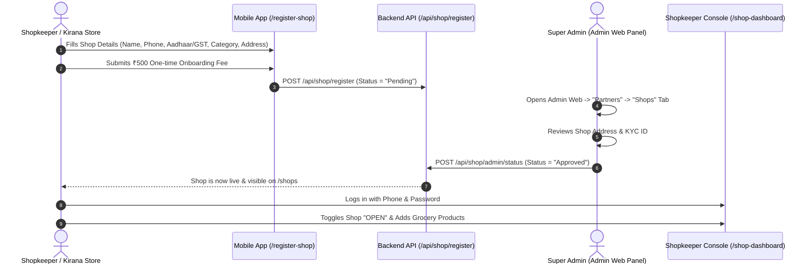
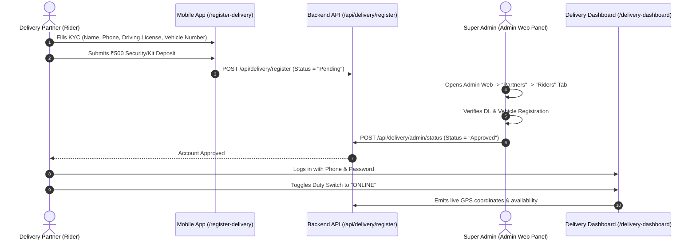
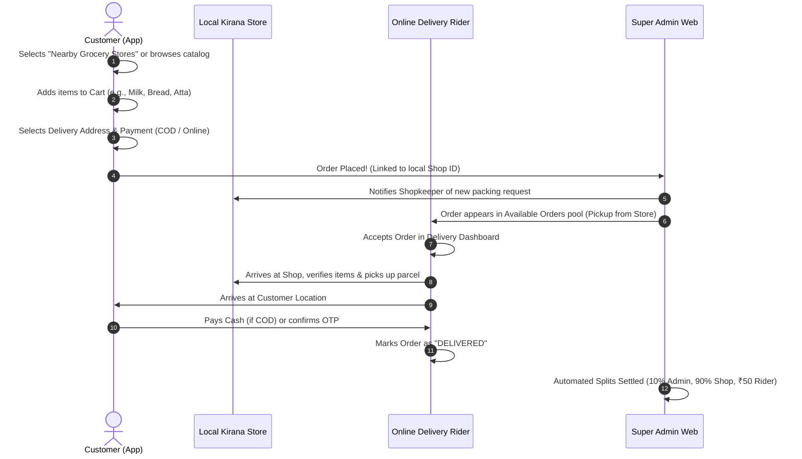

# FreshMart Hyperlocal Grocery App — Architecture, Workflows & Memory Blueprint

> **System Overview:** Hyperlocal Grocery Platform connecting local customers to nearby Kirana & Grocery stores with an on-demand local delivery rider network and a centralized Super Admin control center.

---

## 1. System Ecosystem & Tech Stack

```
                                  ┌────────────────────────┐
                                  │   Super Admin Web      │
                                  │ (Vite + React + Tailwind)│
                                  └───────────┬────────────┘
                                              │ REST API
                                              ▼
┌────────────────────────┐        ┌────────────────────────┐        ┌────────────────────────┐
│   Customer App         │        │    Backend API Server  │        │ Delivery Partner App   │
│ (Expo React Native)    │◄──────►│ (Node/Express/MongoDB) │◄──────►│ (Duty & Order Console) │
└────────────────────────┘        └───────────┬────────────┘        └────────────────────────┘
                                              ▲
                                              │ REST API
                                  ┌───────────┴────────────┐
                                  │  Shopkeeper Console    │
                                  │ (Inventory & Orders)   │
                                  └────────────────────────┘
```

| Component | Technology | Primary Role |
| :--- | :--- | :--- |
| **Customer Mobile App** | Expo (React Native, TypeScript) | Search grocery items, browse nearby stores, place orders (COD / Online), track delivery. |
| **Admin Web Portal** | Vite, React 19, Tailwind CSS, Lucide | Master catalog management, order assignment, shopkeeper & delivery partner approval, commission tracking. |
| **Shop Partner Portal** | Mobile Screen (`/shop-dashboard`) + Web API | Manage grocery items, update stock, toggle shop Open/Closed, view wallet payouts. |
| **Delivery Rider Console** | Mobile Screen (`/delivery-dashboard`) | Go Online/Offline, view nearby grocery orders, accept pickups, navigate to shop & customer, collect COD. |
| **Backend API** | Node.js, Express, MongoDB Atlas, Mongoose | Auth, order dispatching, commission split logic, KYC management, transactional emails. |

---

## 2. Key Changes Made (Transition to Pure Hyperlocal Grocery)

### A. Mobile App (`new/`)
1. **Live Backend Integration:**
   - Switched from broken local/offline IP to active production backend: `https://freshmartapp.onrender.com`.
2. **Authentication Screens Simplified & Centered:**
   - Removed Google sign-in buttons and separator clutter.
   - Pinned the back button at top-left.
   - Vertically and horizontally centered the login and signup card in viewport.
   - Fixed Android keyboard issue (removed dynamic `elevation` and state changes on input focus that caused keyboard drops).
3. **Pure Grocery Transformation:**
   - Replaced all clothing/fashion slides with fresh grocery banners (Fresh Fruits, Dairy & Milk, Farm Vegetables).
   - Replaced clothing categories with grocery categories (`Vegetables & Fruits`, `Dairy & Breakfast`, `Atta, Rice & Dal`, `Snacks & Munchies`, etc.).
   - Product detail screen (`product/[id].tsx`): Changed "Select Size" (S, M, L, XL) to "Select Pack / Weight" (`500g`, `1 kg`, `1 L`, etc.).
4. **Nearby Stores & Hyperlocal Discovery:**
   - Transformed the home screen store promo card to **"Nearby Grocery & Kirana Stores"**.
   - Updated `/shops` directory with grocery categories (`Daily Kirana & Staples`, `Fruits & Vegetables`, `Dairy & Bakery`, `Snacks & Munchies`, `Organic & Supermarket`).
   - Cleaned up Shop Partner registration (`/register-shop`) to grocery presets.
   - Cleaned up Shopkeeper Dashboard (`/shop-dashboard`) to list grocery items by weight/pack size instead of building material.

### B. Admin Web Panel (`admin-web/`)
1. **Catalog Realigned to Grocery:**
   - `AddProduct.tsx`: Removed garment sizes (S, M, L, XL, XXL) and garment categories (Topwear, Bottomwear, Winterwear).
   - Added grocery pack sizes: `100g, 250g, 500g, 1 kg, 2 kg, 5 kg, 10 kg, 500 ml, 1 L, 2 L, Pack / Unit`.
   - Updated category selection to standard grocery taxonomy.
2. **Promotions & Header:**
   - `Banners.tsx`: Set banner targets to grocery categories.
   - `Header.tsx`: Changed subtext to grocery inventory.
3. **Partners KYC Management:**
   - Retained and verified the multi-tab partner portal (`admin-web/src/pages/Partners.tsx`) for reviewing Shop applications and Delivery Rider applications.

---

## 3. Operational Workflows & Flow Diagrams

### Workflow 1: Shopkeeper Onboarding & Approval



#### Where is the Shop Form?
- **Primary Form (Merchant self-registration):** Located on Mobile App at `/app/(auth)/register-shop.tsx`.
- **Review & Approval:** Exclusively handled on the **Admin Web Panel** (`/partners` tab). Admin can review owner name, GST/Aadhaar number, phone, and approve or reject with 1 click.
- *(Optional)* Super Admin can also directly create or seed shops via database scripts or admin portal.

---

### Workflow 2: Delivery Rider Onboarding & Duty Flow



#### Where is the Delivery Rider Form?
- **Registration Form:** Located on Mobile App at `/app/(auth)/register-delivery.tsx`.
- **Approval Console:** Exclusively inside **Admin Web Panel** under `Partners -> Riders` tab.
- **Duty Console:** Rider operates via `/app/(root)/delivery-dashboard.tsx` to turn duty on/off and view pickups.

---

### Workflow 3: Customer Hyperlocal Ordering & Delivery Lifecycle



---

## 4. Financial & Revenue Split Mechanics

For every order placed, the backend calculates the exact distribution automatically (`backend/controller/orderController.js`):

$$\text{Total Paid by Customer} = \text{Items Subtotal} + \text{Delivery Fee (e.g. ₹50)}$$

| Recipient | Calculation Rule | Example (₹500 Items + ₹50 Delivery) |
| :--- | :--- | :--- |
| **Super Admin Platform** | 10% Platform Commission on Items | **₹50** |
| **Local Grocery Shop** | 90% of Items Subtotal | **₹450** |
| **Delivery Rider** | 100% of Delivery Fee | **₹50** |

Both Shopkeepers and Delivery Riders can see their accumulated balance inside their respective dashboards and submit a **Withdrawal / Payout Request** via UPI.

---

## 5. Directory & Screen Sitemap

### Mobile App (`new/app/`)
| Route | Access | Purpose |
| :--- | :--- | :--- |
| `(auth)/sign-in` | Public | Customer clean phone/email login. |
| `(auth)/sign-up` | Public | New customer registration. |
| `(auth)/register-shop` | Public / Partner | Shopkeeper registration form (Name, GST/Aadhaar, Store category). |
| `(auth)/register-delivery`| Public / Partner | Delivery boy registration form (DL, Vehicle number, Phone). |
| `(root)/(tabs)/index` | Customer | Hyperlocal home screen, grocery banners, fast categories, nearby store button. |
| `(root)/(tabs)/explore` | Customer | Category-wise grocery search and filters. |
| `(root)/(tabs)/profile` | Customer | Order history, addresses, switch to merchant/rider portals. |
| `(root)/shops` | Customer | List of verified nearby local grocery stores with distance, status, call & WhatsApp. |
| `(root)/shop/[id]` | Customer | Store profile, all grocery products sold by this specific store. |
| `(root)/cart` | Customer | Cart with grocery items, delivery breakdown. |
| `(root)/checkout` | Customer | Address selection, delivery instructions, COD / Online payment. |
| `(root)/orders` | Customer | Live order tracking timeline. |
| `(root)/shop-dashboard` | Shopkeeper | Shop management: add grocery products, toggle shop Open/Close, wallet payouts. |
| `(root)/delivery-dashboard`| Rider | Duty toggle (Online/Offline), accept order pickup, navigation, mark delivered. |

### Admin Web Panel (`admin-web/src/pages/`)
| Page | Route | Features |
| :--- | :--- | :--- |
| `Dashboard.tsx` | `/` | Total grocery GMV, active stores, online riders, pending orders. |
| `Orders.tsx` | `/orders` | Real-time order dispatch, rider assignment, status tracking. |
| `Products.tsx` | `/products` | Master grocery product inventory, stock editing, pricing. |
| `AddProduct.tsx` | `/add` | Add new grocery item with grocery categories and pack weights (`100g, 500g, 1kg, 1L`). |
| `Banners.tsx` | `/banners` | Home screen grocery promo banners. |
| `Partners.tsx` | `/partners` | **KYC Approval Center:** Review and approve/reject Shop partners and Delivery riders; finance split summary. |
| `Returns.tsx` | `/returns` | Customer refund/return claims. |

---

## 6. Key Backend Models & API Endpoints

### Models
1. **`Shop`** (`backend/model/shopModel.js`): Store details, owner, GST/Aadhaar, address (lat/long), `isOpen`, `status` (Pending/Approved/Rejected), `walletBalance`.
2. **`DeliveryPartner`** (`backend/model/deliveryModel.js`): Rider details, driving license, vehicle type & number, `isOnline`, `currentLocation`, `status`, `walletBalance`.
3. **`Product`** (`backend/model/productModel.js`): Name, price, grocery category, sizes (`100g, 500g, 1kg, 1L`), `shopId`, `shopName`, `shopPhone`, `isAvailable`.
4. **`Order`** (`backend/model/orderModel.js`): Customer ID, items, amounts, `shopId`, `deliveryBoyId`, `deliveryStatus` (Unassigned/Assigned/Picked/Delivered), `adminCommission`, `shopPayout`, `deliveryBoyPayout`.

### API Routes
- **Shops:**
  - `GET /api/shop/list` — Public list of approved stores.
  - `GET /api/shop/:id` — Store details and store products.
  - `POST /api/shop/register` — Shop partner application.
  - `GET /api/shop/admin/all` — Admin view of all shops.
  - `POST /api/shop/admin/status` — Admin approve/reject shop.
- **Delivery:**
  - `POST /api/delivery/register` — Rider application.
  - `POST /api/delivery/toggle-online` — Turn rider duty ON/OFF.
  - `GET /api/delivery/available-orders` — Orders waiting for pickup.
  - `POST /api/delivery/accept-order` — Rider claims an order.
  - `POST /api/delivery/update-status` — Mark Picked up / Delivered.
  - `GET /api/delivery/admin/all` — Admin view of riders.
  - `POST /api/delivery/admin/status` — Admin approve/reject rider.
- **Orders:**
  - `POST /api/order/place` — COD order creation with automated split calculations.
  - `POST /api/order/razorpay` — Online payment flow.
  - `GET /api/order/userorders` — Customer orders list.
  - `POST /api/order/status` — Update order progress.
